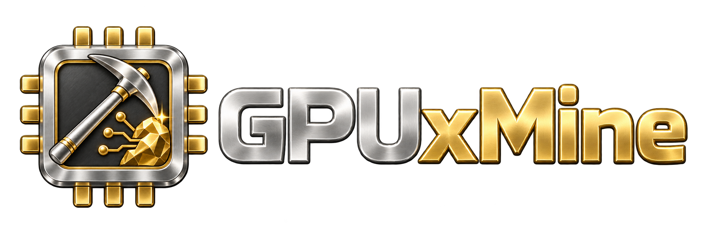

<div align="center">



**แบ่งปันการ์ดจอที่บ้าน รับงาน AI แล้วได้ค่าตอบแทน**

</div>

---

GPUxMINE เปลี่ยนพีซีที่เปิดทิ้งไว้ให้เป็นโหนดประมวลผลของเครือข่าย AI — เครื่องรับงานเท่าที่เจ้าของอนุญาต คืนการ์ดให้ทันทีเมื่อเจ้าของกลับมาใช้ และจ่ายค่าตอบแทนเข้ากระเป๋า [XMAN Studio](https://xman4289.com) (ใช้จ่ายบน XMAN Studio และ AIXMAN ได้ · ยังถอนเป็นเงินสดไม่ได้)

รีโปนี้คือ **ตัวไคลเอนต์และตัวกลาง** ส่วนระบบจับคู่งานและการคิดเงินอยู่ฝั่งแพลตฟอร์ม

---

## ทำไมถึงออกแบบแบบนี้

พีซีที่บ้านอยู่หลัง NAT/CGNAT — เปิดพอร์ตไม่ได้ และ**ไม่ควรสอนให้ใครเปิด** เครือข่ายนี้จึงกลับทิศ: **โหนดต่อออกไปหา relay แล้วถือสายไว้** งานวิ่งลงมาตามสายนั้น

relay ไม่ได้เลียนแบบ API ของ ComfyUI ทีละเส้น — มันเป็น **ท่อ HTTP**

```
แพลตฟอร์ม --HTTP--> relay /w/{workerId}/* --WebSocket--> agent --HTTP--> ComfyUI ในเครื่อง
```

คำขอทั้งก้อนถูกห่อส่งลง WebSocket แล้วคลายออกอีกฝั่ง ผลคือฝั่งแพลตฟอร์มเห็นโหนดที่บ้านเป็นแค่ base URL หนึ่ง

ท่อนี้ส่งต่อ**เฉพาะเส้นทางที่แพลตฟอร์มใช้จริง** (ส่งงาน อ่านผล ดาวน์โหลดไฟล์ผลงาน ลบงานที่ส่งแล้ว) ส่วนเส้นทางอื่นของ ComfyUI บนเครื่องเจ้าของ เช่น การติดตั้ง custom node ถูกปฏิเสธ รายการนี้อยู่ใน `GpuxMine.Protocol` ชุดเดียว relay และตัวลูกตรวจซ้ำกันคนละชั้น — เพิ่มเส้นทางใหม่ต้องแก้ที่นั่นที่เดียว

เฟรมบนสาย:

```
[1 ไบต์ version][4 ไบต์ ความยาว header][JSON header][body ดิบ]
```

body เป็นไบต์ดิบ **ไม่ใช้ base64** — รูปและวิดีโอทุกชิ้นวิ่งผ่านทางนี้ ถ้าเข้ารหัส base64 ของที่ใหญ่ที่สุดในระบบจะโตขึ้นหนึ่งในสามทุกครั้ง

---

## งานเดินทางอย่างไร ตั้งแต่จับคู่จนเงินเข้ากระเป๋า

1. **จับคู่** — เจ้าของขอรหัสจากหน้า GPUxMINE บน XMAN Studio แล้วกรอกในโปรแกรม เครื่องได้ตัวตนของตัวเองและเริ่มแชร์ทันที โปรแกรมจำว่าเปิดแชร์ไว้ ปิดเปิดใหม่หรืออัปเดตก็กลับมาแชร์เองจนกว่าจะกด STOP (หลังรีสตาร์ตเครื่อง กลับมาเองเมื่อเปิด "Start with Windows" ไว้)
2. **ประเมินเครื่อง** — วัดความเร็วการ์ดด้วยงานมาตรฐานผ่าน ComfyUI ในเครื่อง ได้ผลต่อประเภทงานว่ารับได้เต็มความเร็ว รับได้แบบงานไม่เร่ง หรือรับไม่ได้ ประเมินใหม่เองเมื่อเปลี่ยนการ์ด เปลี่ยนเวอร์ชัน หรือผลเกิน 30 วัน
3. **เข้า pool** — XMAN Studio ส่งข้อมูลเครื่องให้ pool (AIXMAN) ซึ่งตัดสินว่าเครื่องนี้รับงานโมเดลไหนได้ เครื่องชุมชนได้เฉพาะโมเดลที่ทำไว้สำหรับการ์ดบ้าน และเฉพาะงานเนื้อหาทั่วไปที่ไม่มีไฟล์ของลูกค้าติดมา
4. **รับงานทีละงาน** — ก่อนรับทุกงาน เครื่องตัดสินอีกครั้ง: เจ้าของกำลังใช้เครื่องหรือเปิดเกมเต็มจอ อยู่นอกตารางเวลา อุณหภูมิถึงเพดาน หรือกำลังทำงานอื่นอยู่ = ตอบว่า "ยังไม่ใช่ตอนนี้" ไม่ใช่ "เครื่องเสีย"
5. **ส่งผล แล้วลบ** — pool ดึงผลงานผ่าน relay แล้วสั่งให้เครื่องลบไฟล์ผลงานและประวัติของงานนั้น ถ้าไม่มีใครสั่ง เครื่องลบเองหลัง 6 ชั่วโมง งานของเจ้าของเองในเครื่องไม่ถูกแตะ
6. **ตัดยอด** — pool บันทึกค่าตอบแทนของงาน พักไว้ตามเวลาที่ XMAN Studio กำหนด (ค่าเริ่มต้น 24 ชั่วโมง) แล้วเข้ากระเป๋า XMAN อัตโนมัติเป็นรอบทุกชั่วโมง งานที่ดูผิดปกติรอผู้ดูแลตรวจก่อน
7. **เจ้าของเห็นทั้งหมด** — ทุกไม่กี่นาที โปรแกรมถาม XMAN Studio ว่า pool มองเครื่องนี้อย่างไร (พร้อมรับงาน / ยังไม่มีงานที่ตรง / ถูกระงับ พร้อมเหตุผล) และแต่ละงานได้เท่าไร อยู่ขั้นไหน แล้วแสดงในหน้า Dashboard · Wallet · History

งานที่แชร์ฟรีตามสัดส่วนที่เจ้าของตั้งไม่ได้ค่าตอบแทน — pool บันทึกมูลค่าไว้ให้เห็นในหน้า Wallet

กด STOP = เครื่องไม่รับงานใหม่ทันที แต่ต่อสายไว้จนส่งงานที่รับไว้ครบ (มีปุ่ม "หยุดทันที" แยก พร้อมบอกตรง ๆ ว่างานที่ค้างจะไม่ได้ค่าตอบแทน)

---

## โครงสร้าง

| โปรเจกต์ | หน้าที่ |
|---|---|
| `GpuxMine.Protocol` | สัญญาข้อมูลที่ไคลเอนต์กับ relay **ใช้ร่วมกัน** — เป็นโค้ดชุดเดียวจึงเพี้ยนกันไม่ได้ |
| `GpuxMine.Core` | ตัวตนเครื่อง · ไลเซนส์/ทะเบียนเครื่อง · อัปเดตตัวเอง (ไม่ผูก Windows) |
| `GpuxMine.Node` | **ทุกอย่างที่โหนดทำ** — ตั้งค่า, ตัดสินใจรับงาน, รันไทม์ ComfyUI, เซสชัน relay — ไม่มี UI ไม่ผูก Windows |
| `GpuxMine.Hardware` | อ่านค่าการ์ดจอผ่าน LibreHardwareMonitor + ตรวจว่าเจ้าของกำลังใช้เครื่อง (Windows) |
| `GpuxMine.Relay` | ASP.NET Core — รับ WebSocket จาก agent, เปิดผิว HTTP ให้แพลตฟอร์ม, ตรวจ token |
| `GpuxMine.Agent` | ตัวลูกแบบ console/headless — ห่อ `NodeHost` บาง ๆ สำหรับริกที่ไม่มีหน้าจอ |
| `GpuxMine.App` | ตัวลูกแบบหน้าต่าง (WPF) + ไอคอนถาด — ทุกหน้าผูกกับ `NodeHost` ตัวเดียวกัน |

### กติกาที่ทำให้ต่อยอดง่าย

`GpuxMine.App` **ไม่มี business logic** — มันอ่าน `NodeState` แล้ววาด · ทุกอย่างที่ตัดสินใจอยู่ใน `GpuxMine.Node` · Windows แตะได้เฉพาะ `GpuxMine.Hardware` ผ่าน interface สองตัว (`ITelemetrySource`, `IUserActivitySource`) — วันที่ต้องการ Linux หรือ Avalonia จะเปลี่ยนแค่โปรเจกต์เดียว

### สิ่งที่หน้าจอบอกและไม่บอก

ตัวเลขทุกตัวบนหน้าจอ**วัดจากเครื่องนี้**หรือ**แพลตฟอร์มรายงานมา** — ไม่มีการประมาณเป็นตัวเงิน ยอดกระเป๋า ค่าตอบแทนรายงาน และสถานะของเครื่องใน pool มาจาก XMAN Studio เป็นสตางค์ตรงตามที่ระบบบันทึก ตรงไหนที่ยังไม่มีข้อมูล หน้าจอแสดง "—" พร้อมบอกว่าทำไม ไม่ใช่ ฿0.00 ตัวเลข ฿187.42 ในดีไซน์ต้นแบบเป็นแค่ตัวอย่าง และตัวอย่างที่ดูเหมือนยอดเงินจริงคือวิธีที่ผลิตภัณฑ์ได้คำว่า "หลอกลวง" มาติดตัว

`.NET 10` · Windows และ Linux (ริกขุดที่ว่างอยู่ใช้ได้ ไม่ต้องมีหน้าจอ)

---

## สำหรับเจ้าของเครื่อง

1. ติดตั้ง [ComfyUI](https://github.com/comfyanonymous/ComfyUI) ให้รันได้ในเครื่อง พร้อม checkpoint ของ SDXL ในโฟลเดอร์ `checkpoints` (การ์ด 6 GB ขึ้นไป) — โปรแกรมนี้ไม่ลง ComfyUI หรือโหลดโมเดลให้
2. ลงโปรแกรมจาก [Releases](https://github.com/xjanova/GpuXmine/releases/latest)
3. เข้าเว็บ XMAN Studio → เครื่องของฉัน → ขอรหัสจับคู่ แล้วกรอกในหน้า Settings ของโปรแกรม
4. รอให้โปรแกรมประเมินเครื่องเสร็จ แล้วดูแผง POOL ในหน้า Dashboard ว่าเครื่องพร้อมรับงานหรือยัง ถ้ายัง บรรทัดใต้นั้นบอกเหตุผล

---

## ลองรันในเครื่องเดียว

**1. relay**

```bash
GPUXMINE_ADMIN_KEY=devkey ASPNETCORE_URLS=http://127.0.0.1:5080 dotnet run --project src/GpuxMine.Relay
```

ไม่ตั้ง `GPUXMINE_ADMIN_KEY` ก็ได้ — relay จะสุ่มให้แล้วพิมพ์ใน log ตั้งใจให้ไม่มีค่าเริ่มต้นตายตัว เพราะ relay ที่มาพร้อมคีย์ที่ใคร ๆ ก็รู้ คือ relay ที่ใคร ๆ ก็เอาเครื่องมาเสียบได้

**2. ลงทะเบียนเครื่อง**

```bash
curl -s -X POST -H "X-Admin-Key: devkey" "http://127.0.0.1:5080/enroll?label=my-pc"
```

ได้ `workerId` กับ `token` กลับมา — **token แสดงครั้งเดียว** relay เก็บแค่แฮชของมัน

**3. ComfyUI**

```bash
python main.py --listen 127.0.0.1 --port 8188
```

**4. ตัวลูก — เลือกอย่างใดอย่างหนึ่ง**

หน้าต่าง (Windows):

```bash
dotnet run --project src/GpuxMine.App -- \
  --WorkerId gxm-xxxxxxxxxxxx --Token "<token>" \
  --RelayUrl ws://127.0.0.1:5080/agent --ComfyUrl http://127.0.0.1:8188
```

headless (Windows/Linux ริกไม่มีจอ):

```bash
dotnet run --project src/GpuxMine.Agent -- \
  --WorkerId gxm-xxxxxxxxxxxx --Token "<token>" \
  --RelayUrl ws://127.0.0.1:5080/agent --ComfyUrl http://127.0.0.1:8188
```

`--identity` พิมพ์ตัวตนเครื่องที่ XMAN Studio จะเห็นแล้วออก — สิ่งแรกที่ฝ่ายซัพพอร์ตถาม

ไม่มี GPU ก็ลองท่อได้ด้วย `--Mock true` (ComfyUI จำลองในโปรเซสเดียวกัน)

ตั้งค่าอ่านจาก `agent.json` ข้างไฟล์โปรแกรม, `%LOCALAPPDATA%\GpuxMine\agent.json`, ตัวแปรแวดล้อม `GPUXMINE_*` และ command line

---

## อัปเดตตัวเอง

แท็กเดียว ที่เหลือไหลเอง:

```
git tag v0.2.0 && git push --tags
        │
        └─► GitHub Actions ─► Release ─► เครื่องที่ติดตั้งแล้วอัปเดตตัวเองผ่าน Velopack
```

### สามชั้นที่กันไม่ให้วนรีสตาร์ท

การอัปเดตต้อง **rename โฟลเดอร์ `current`** และแค่มี handle เดียวค้างอยู่บนโฟลเดอร์นั้น — โปรเซสที่ working directory อยู่ข้างในก็พอ — การ rename ก็ล้ม แล้วโปรแกรมรีสตาร์ตมาเจอ staged update อีก วนอย่างนั้นทุก 18–20 วินาที เป็นบทเรียนที่วัดมาจากไคลเอนต์ตัวอื่นในบ้านเดียวกัน

1. ย้าย working directory ออกจากโฟลเดอร์ติดตั้งตั้งแต่บรรทัดแรกของ `Main`
2. ปิดรันไทม์ท้องถิ่นก่อน apply — โปรเซส Python ที่เราสปอว์นเองก็ถือโฟลเดอร์ได้เหมือนกัน
3. **ตัวนับความพยายาม เขียนก่อนเริ่ม apply** เพราะทางที่สำเร็จคือโปรเซสถูกฆ่า จะเขียนทีหลังไม่มีทางได้เขียน ครบ 3 ครั้งที่เวอร์ชันไม่ขยับ → เลิกพยายาม แล้วบอกให้รีสตาร์ตเครื่อง

และ **ไม่อัปเดตทิ้งงานกลางทาง** — ก่อนติดตั้ง เครื่องหยุดรับงานใหม่ ทำงานที่รับไว้ให้เสร็จและส่งให้ครบก่อน แล้วรุ่นใหม่กลับมาแชร์เองตามที่เจ้าของเปิดไว้

---

## สถานะ

ครบวงในโค้ดแล้ว: จับคู่ → ประเมิน → เข้า pool → รับงานทีละงาน → ส่งผลแล้วลบ → ตัดยอด → เข้ากระเป๋า → เจ้าของเห็นยอดรายงาน relay และตัวลูกมีชุดทดสอบที่ต้องผ่านก่อนปล่อยทุกรุ่น

ยังไม่ได้ทำ และหน้าจอไม่อ้างว่าทำ:

- ถอนเป็นเงินสด — ค่าตอบแทนอยู่ในกระเป๋า XMAN เท่านั้น
- ลง ComfyUI และโมเดลให้อัตโนมัติ — เจ้าของต้องติดตั้งเอง
- จำกัดกำลังไฟการ์ดจริง — แถบ power profile ยังเป็นแค่การตั้งค่าที่บันทึกไว้ หน้าจอบอกไว้ตรง ๆ
- โมเดลสำหรับการ์ดบ้านยังมีชุดเดียว (SDXL)

เปิดรับเครื่องจากภายนอกเมื่อผ่านรายการตรวจก่อนเปิดระบบของทั้งสามระบบแล้ว

---

## สัญญาอนุญาต

[Apache-2.0](LICENSE)

โค้ดนี้จะถูกรันบนเครื่องของคนอื่น เราจึงเปิดให้อ่านได้ทั้งหมด — ไม่มีอะไรในนี้ที่ต้องเชื่อโดยไม่เห็น
